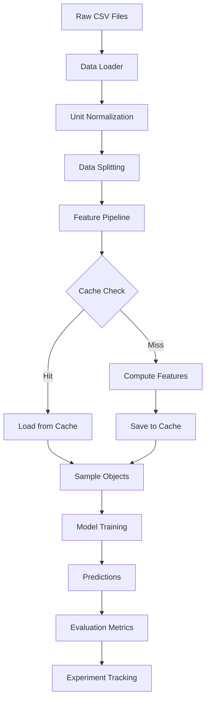
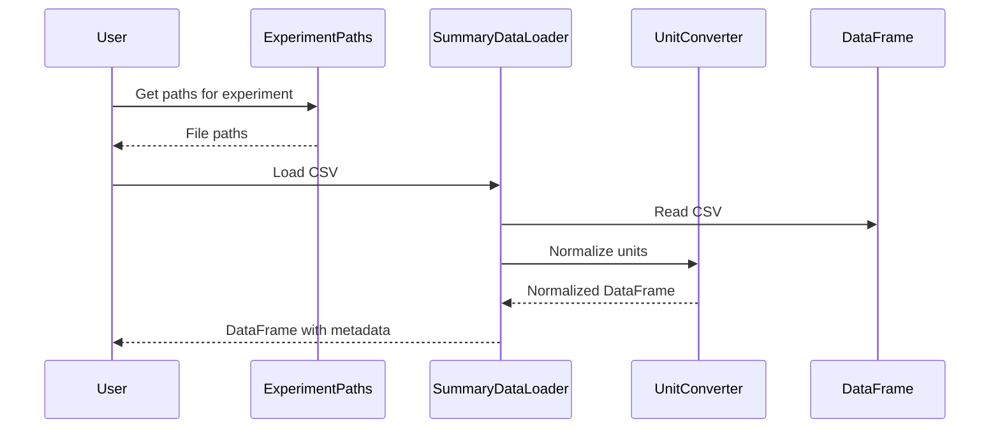
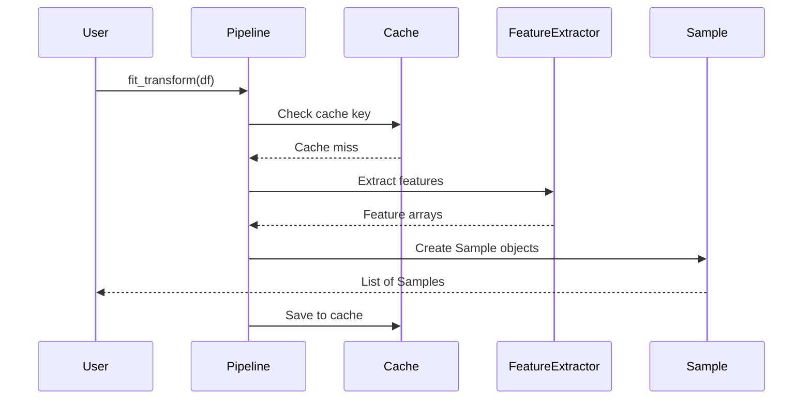
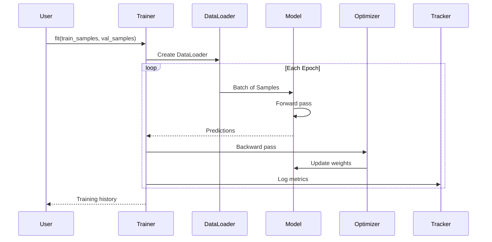
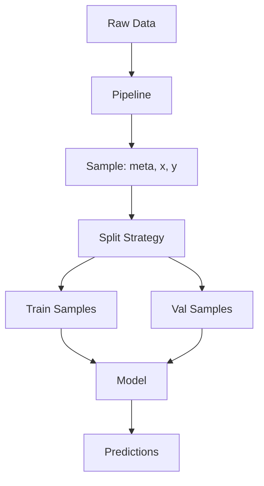
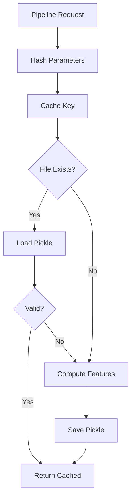
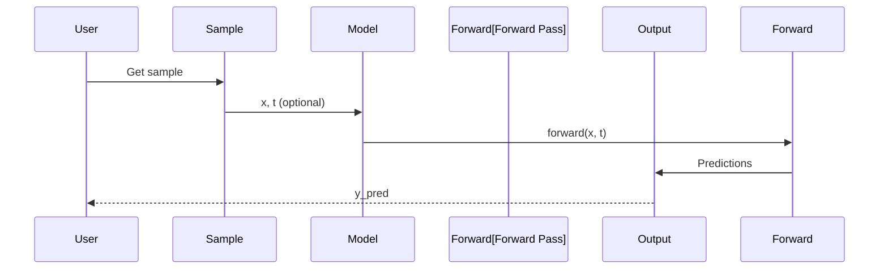
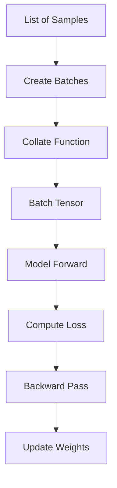
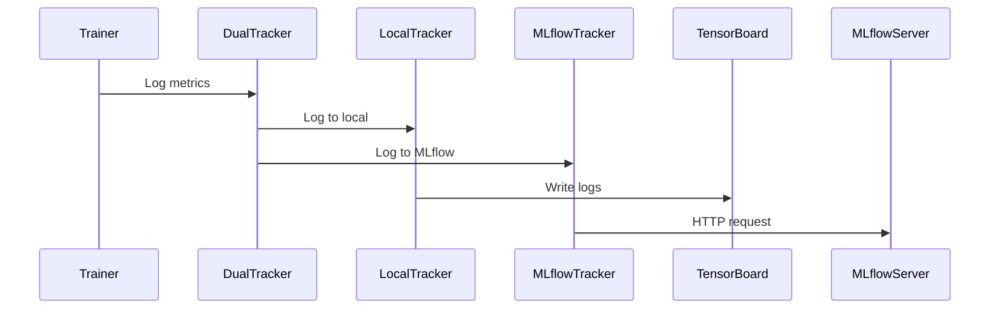
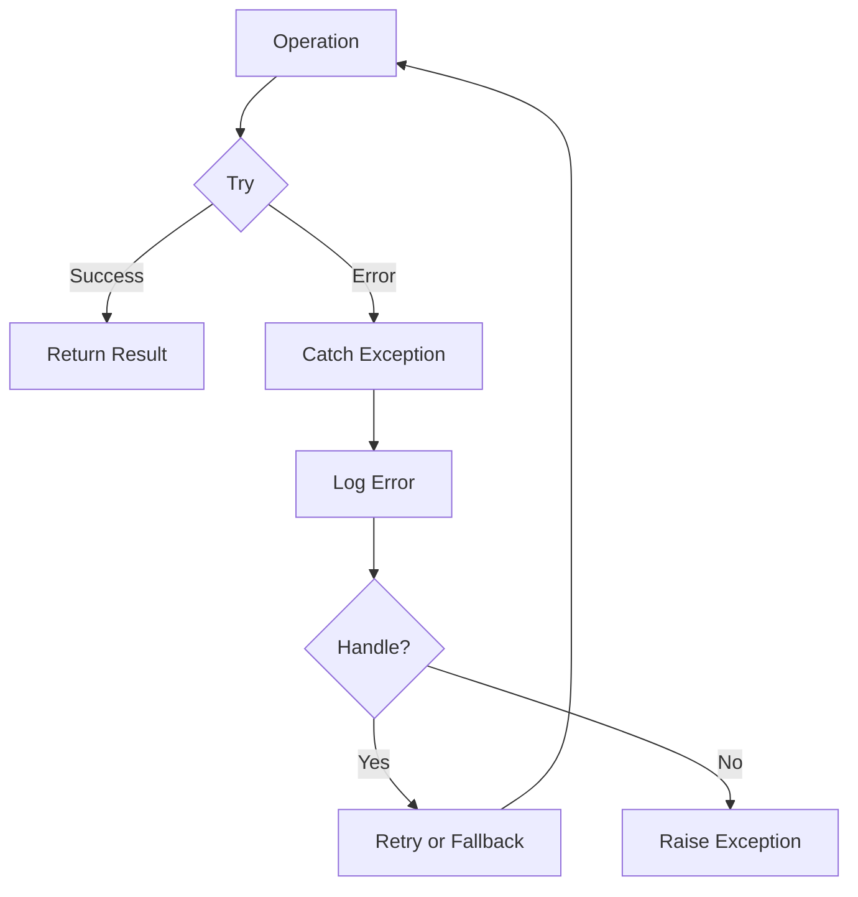

# Data Flow

This document describes the complete data flow from raw CSV files to model predictions.

## High-Level Flow

## Detailed Data Flow

### 1. Data Loading

### 2. Feature Extraction

### 3. Model Training

## Sample Object Flow

## Cache Flow

## Model Inference Flow

## Batch Processing

## Tracking Flow

## Error Handling Flow

## Next Steps

- [Design Patterns](design-patterns.md) - Design pattern details
- [Pipeline System](pipeline-system.md) - Pipeline internals
- [Model System](model-system.md) - Model internals
