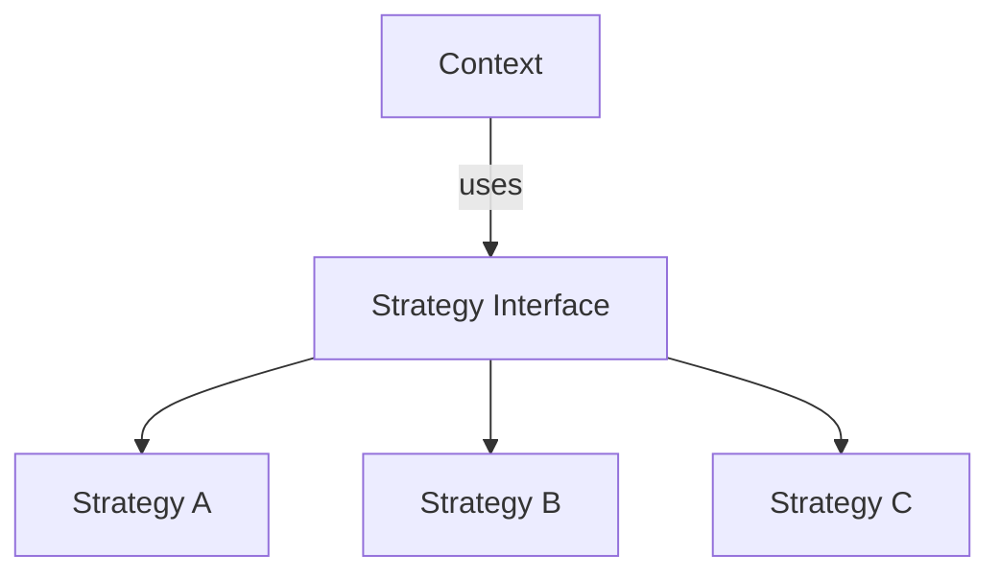
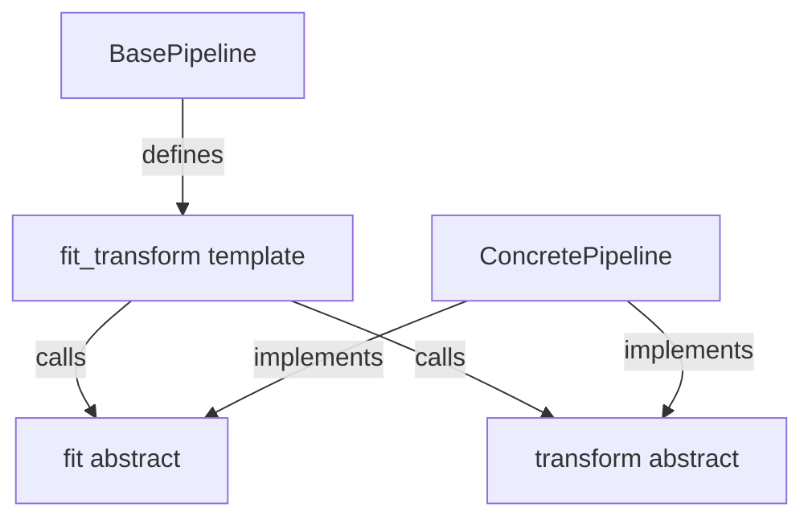
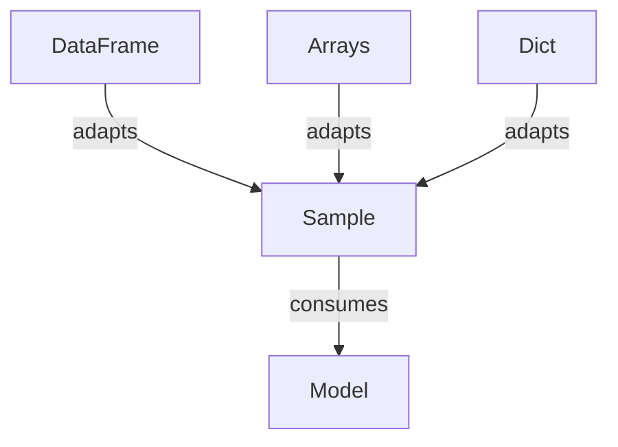
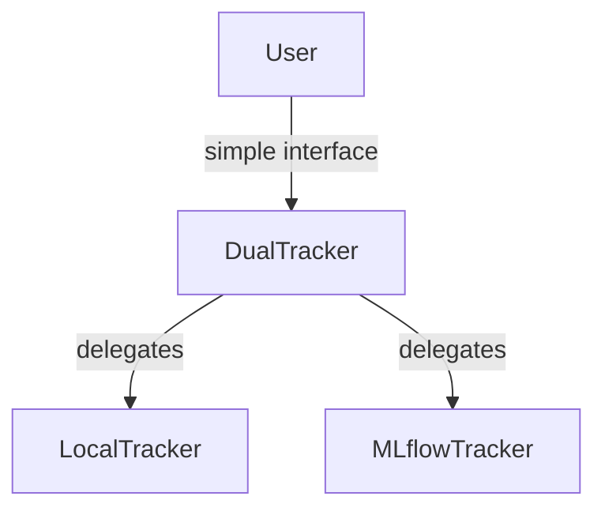
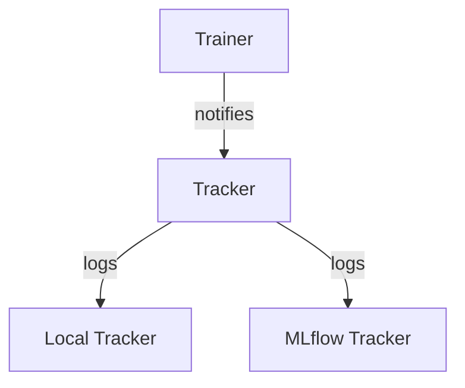
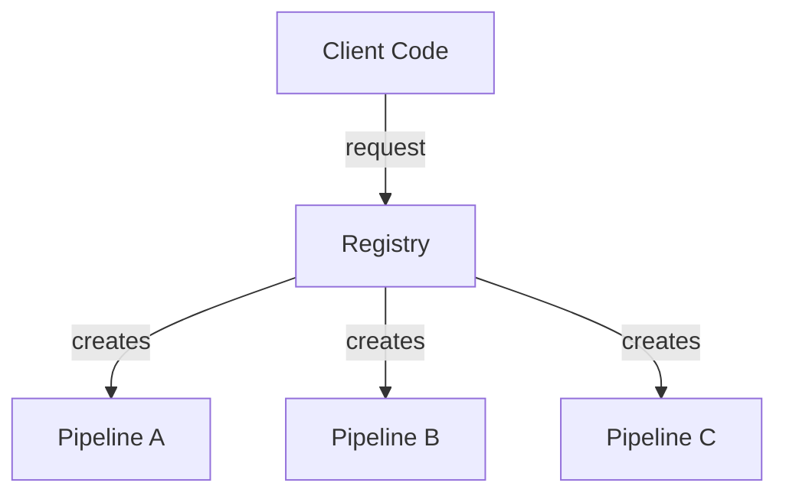
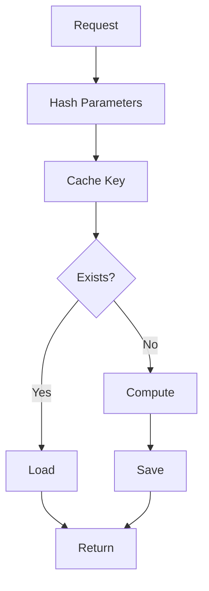
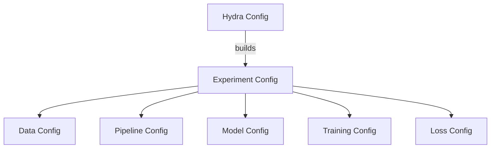

# Design Patterns

BatteryML uses several design patterns to achieve modularity, extensibility, and maintainability.

## Registry Pattern

The registry pattern enables plugin-like extensibility without modifying core code.

### Implementation

```mermaid
graph TB
    Pipeline[Pipeline Class] -->|@register decorator| Registry[PipelineRegistry]
    Registry -->|get method| Instance[Pipeline Instance]
    Config[Config String] -->|name| Registry
    User[User Code] -->|get| Registry
```

### Benefits

- **Discoverability**: List all available components
- **Consistency**: Enforced interface through base classes
- **Configuration**: Instantiate from config strings
- **Extensibility**: Add components without modifying core

### Example

```python
# Pipelines
@PipelineRegistry.register("my_pipeline")
class MyPipeline(BasePipeline):
    pass

pipeline = PipelineRegistry.get("my_pipeline", param=value)

# Models
@ModelRegistry.register("my_model")
class MyModel(BaseModel):
    pass

model = ModelRegistry.get("my_model", input_dim=10)

# Loss Functions
@LossRegistry.register("my_loss")
class MyLoss(BaseLoss):
    pass

loss = LossRegistry.get("my_loss", reduction='mean')
```

## Strategy Pattern

Different algorithms (splits, models, pipelines) are interchangeable.

### Implementation



### Examples

- **Split Strategies**: Temperature split, LOCO, temporal split
- **Models**: LightGBM, MLP, LSTM, Neural ODE
- **Pipelines**: Summary, ICA, Sequence
- **Loss Functions**: MSE, Huber, Physics-Informed, MAPE

## Template Method Pattern

Base classes define algorithm structure, subclasses fill in details.

### Implementation



### Example

```python
class BasePipeline(ABC):
    def fit_transform(self, data):
        # Template method
        self.fit(data)
        return self.transform(data)
    
    @abstractmethod
    def fit(self, data):
        pass
    
    @abstractmethod
    def transform(self, data):
        pass
```

## Adapter Pattern

The Sample dataclass adapts different data formats to a common interface.

### Implementation



### Benefits

- **Decoupling**: Pipelines and models are decoupled
- **Flexibility**: Support multiple input formats
- **Consistency**: Single interface for all models

## Facade Pattern

High-level interfaces hide complexity of subsystems.

### Implementation



### Example

```python
class DualTracker:
    def log_metrics(self, metrics):
        self.local_tracker.log_metrics(metrics)
        self.mlflow_tracker.log_metrics(metrics)
```

## Observer Pattern

Trackers observe training progress and log events.

### Implementation



## Factory Pattern

Registry acts as factory for creating component instances.

### Implementation



## Caching Pattern

Hash-based caching with automatic invalidation.

### Implementation



### Benefits

- **Performance**: Skip expensive computations
- **Reproducibility**: Same inputs = same outputs
- **Safety**: Automatic invalidation

## Builder Pattern

Config objects build complex configurations.

### Implementation



## Next Steps

- [Pipeline System](pipeline-system.md) - Pipeline architecture details
- [Model System](model-system.md) - Model architecture details
- [Contributing](../contributing/overview.md) - How to extend the system
