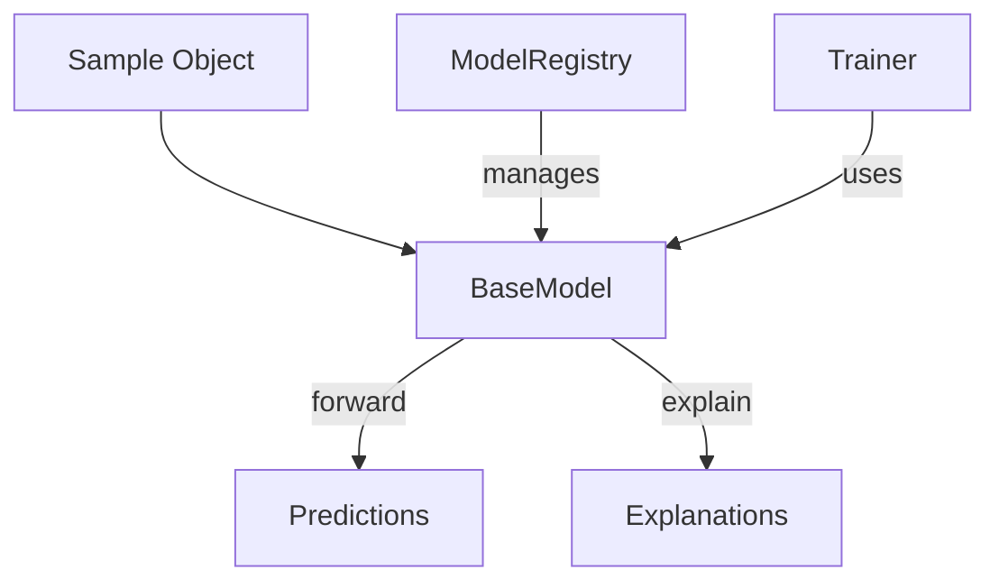
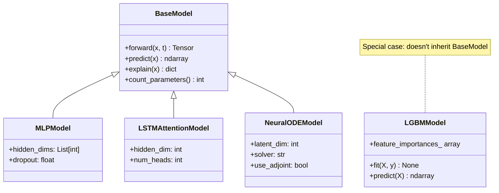
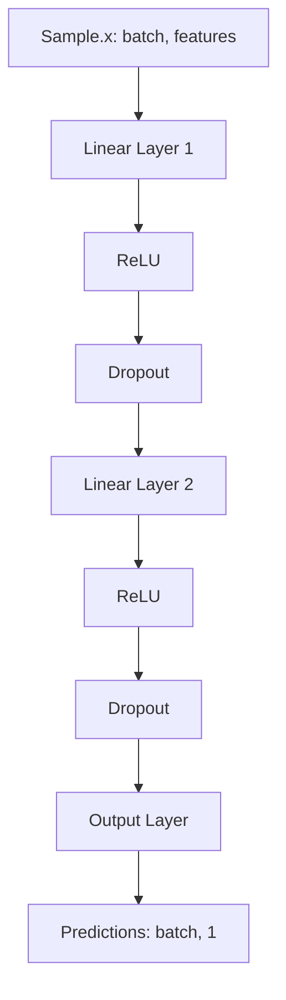
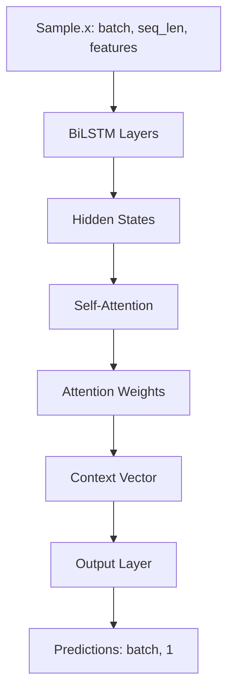
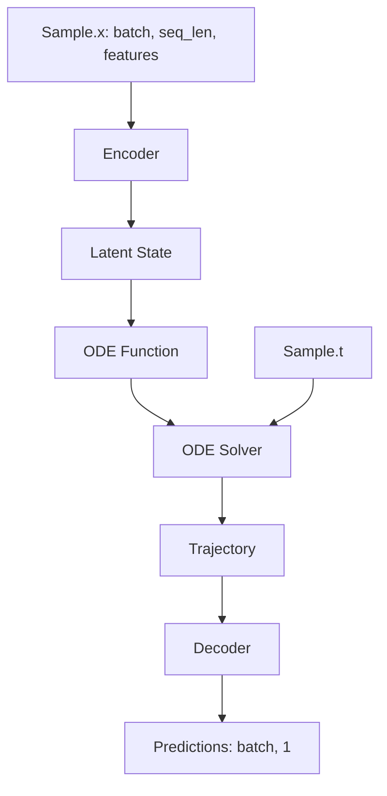
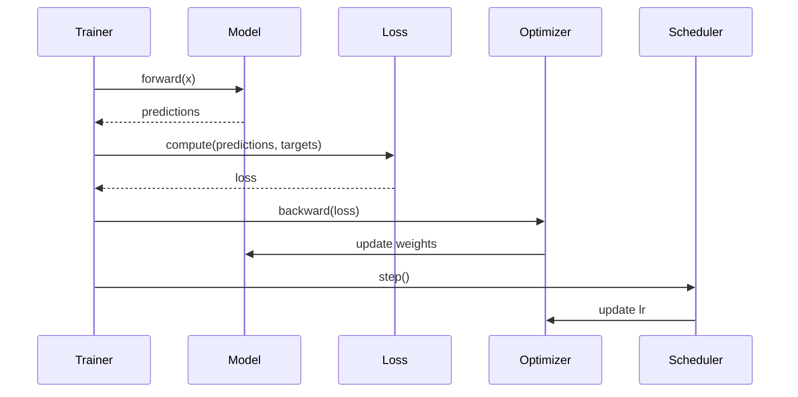
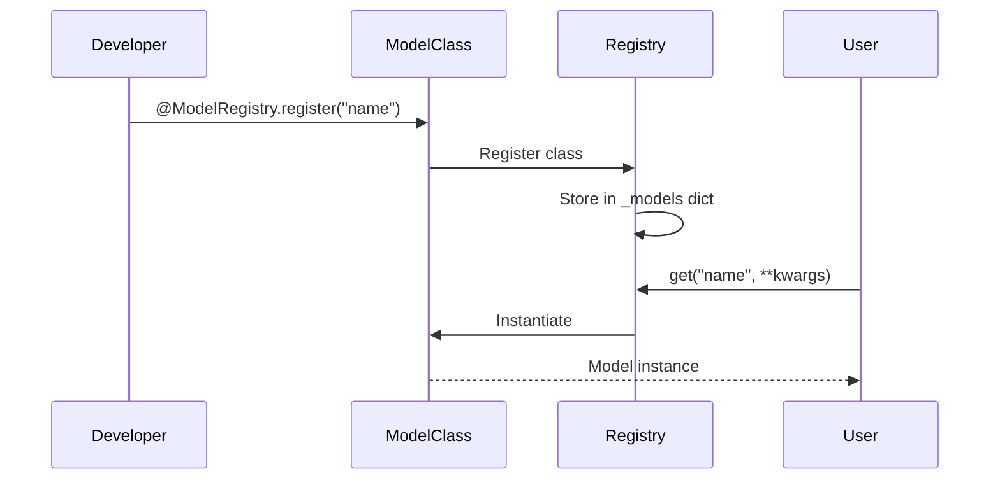
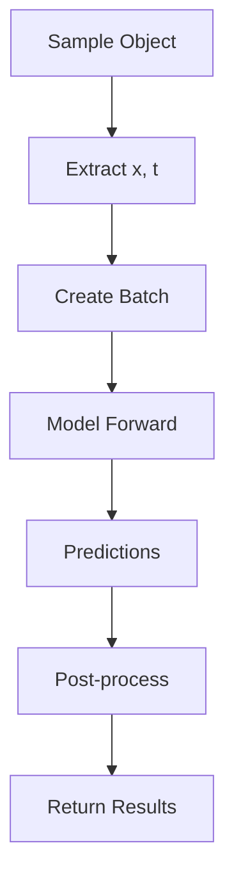
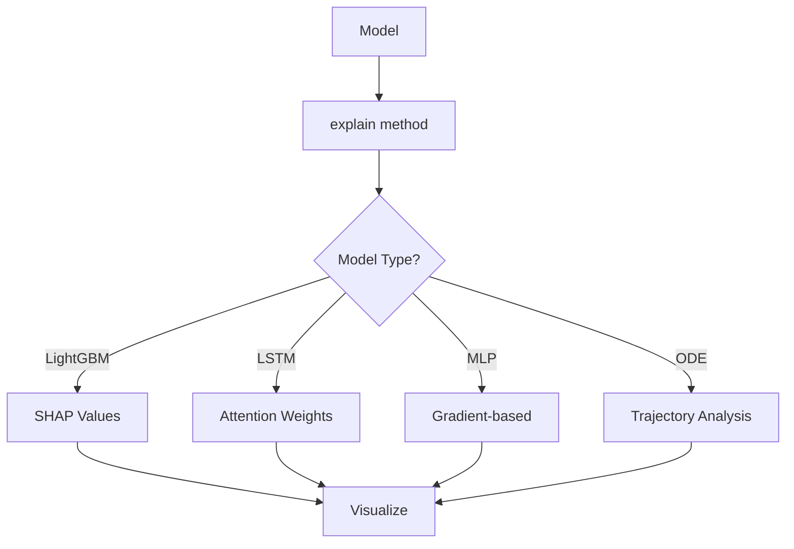
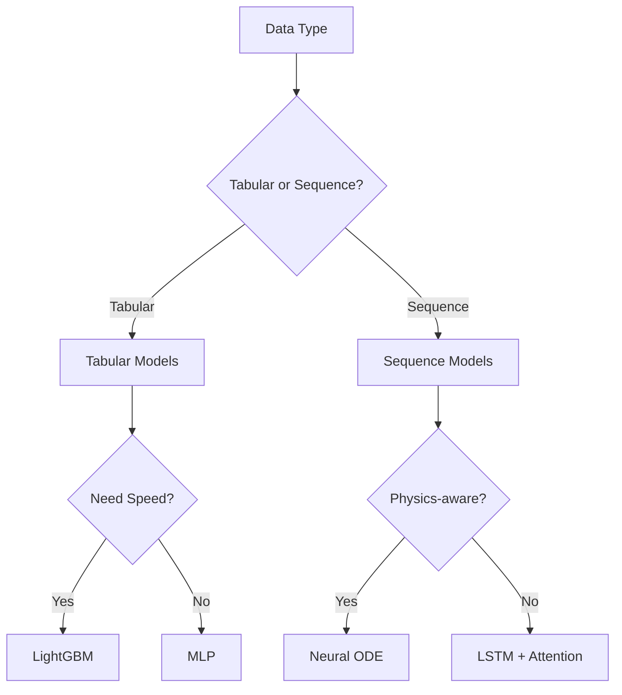

# Model System

The model system provides a unified interface for different model architectures.

## Model Architecture

## Model Hierarchy

## Forward Pass Flow

### Tabular Models (MLP)

### Sequence Models (LSTM)

### ODE Models (Neural ODE)

## Training Flow

## Model Registration

## Model Inference

## Explainability Flow

## Model Selection

## Next Steps

- [Models Guide](../user-guide/models.md) - Model usage guide
- [Custom Model](../examples/custom-model.md) - Create custom model
- [API Reference](../api/models.md) - Complete API docs
