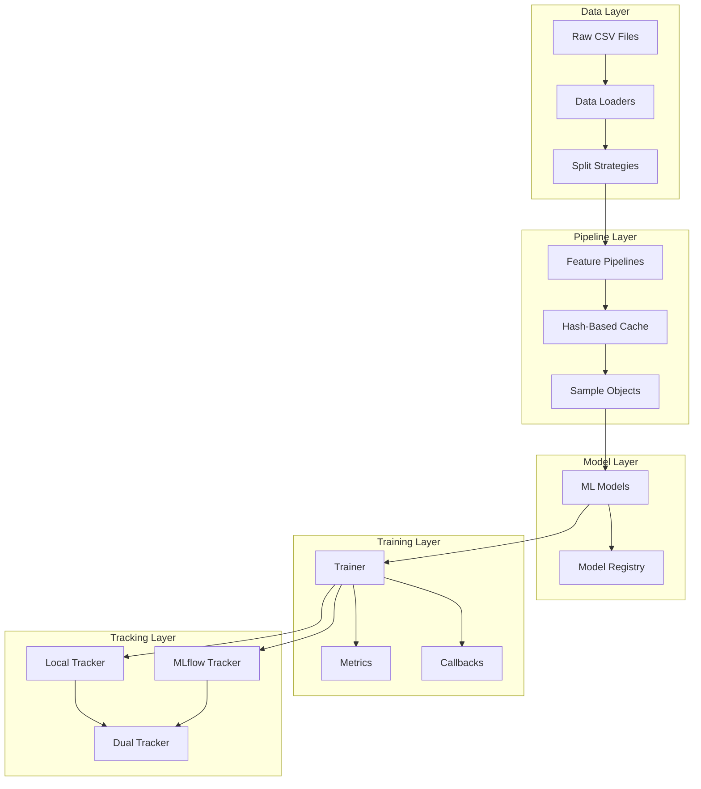
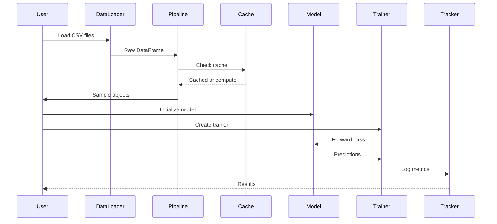
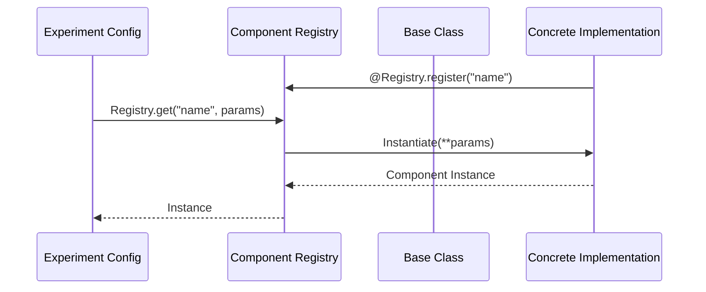
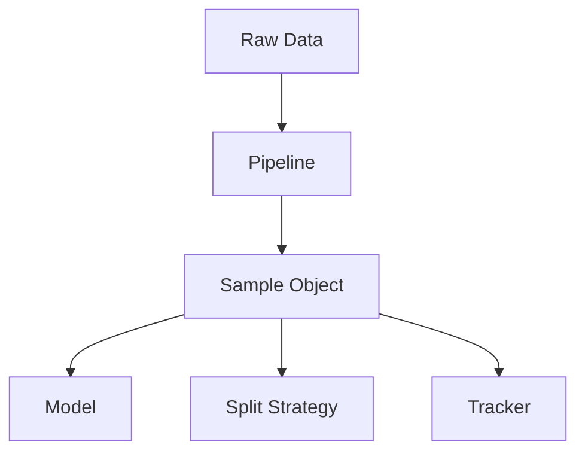
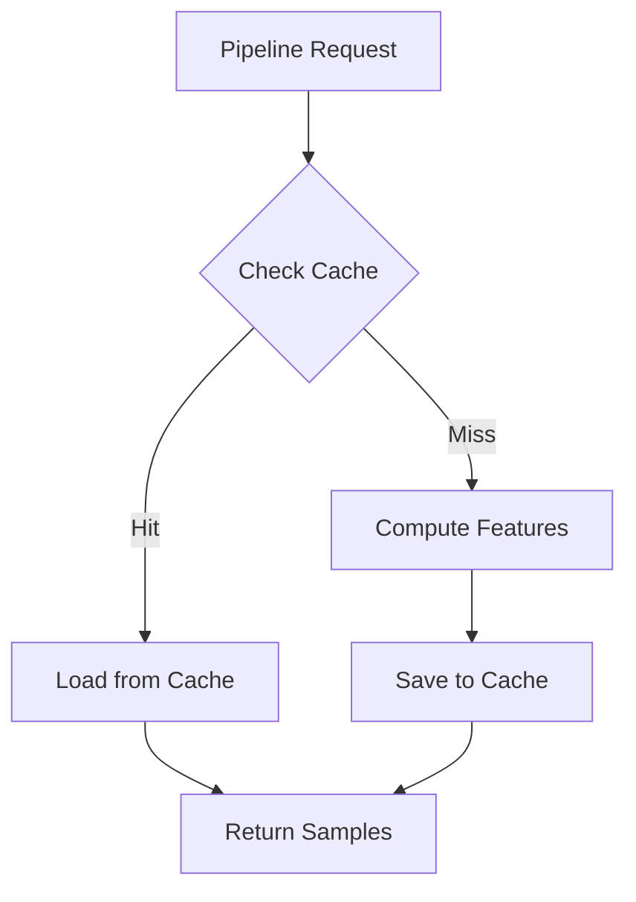

# Architecture Overview

BatteryML is designed with modularity, extensibility, and reproducibility in mind. This document provides a high-level overview of the system architecture.

## System Architecture

## Component Overview

### Data Layer

- **Data Loaders**: Load CSV files from experiments
- **Unit Conversion**: Normalize units (mAh → Ah, °C → K)
- **Split Strategies**: Temperature holdout, LOCO, temporal splits

### Pipeline Layer

- **Feature Extraction**: Transform raw data to features
- **Caching**: Cache expensive computations (ICA)
- **Sample Schema**: Universal data format

### Model Layer

- **Model Zoo**: LightGBM, MLP, LSTM, Neural ODE
- **Registry Pattern**: Extensible model registration
- **Base Interface**: Consistent model API

### Training Layer

- **Trainer**: Training loop with AMP, early stopping
- **Metrics**: RMSE, MAE, MAPE, R²
- **Callbacks**: Checkpointing, scheduling

### Tracking Layer

- **Local**: JSON + TensorBoard
- **MLflow**: Experiment management
- **Dual**: Combined tracking

## Design Principles

1. **Modularity**: Components are independent and composable
2. **Extensibility**: Easy to add new pipelines/models
3. **Reproducibility**: Hash-based caching, config management
4. **Type Safety**: Pydantic validation, type hints
5. **Documentation**: Comprehensive docstrings and guides

## Data Flow

## Key Design Patterns

### Registry Pattern

The Registry Pattern decoupled the configuration from the implementation, allows for runtime discovery and instantiation of components.

### Sample Schema

### Caching Strategy

## Extension Points

The architecture provides several extension points:

1. **Pipelines**: Add new feature extraction methods
2. **Models**: Add new model architectures
3. **Splits**: Add new data splitting strategies
4. **Trackers**: Add new tracking backends
5. **Metrics**: Add new evaluation metrics

## Next Steps

- [Data Flow](data-flow.md) - Detailed data flow documentation
- [Design Patterns](design-patterns.md) - Design pattern deep dive
- [Pipeline System](pipeline-system.md) - Pipeline architecture
- [Model System](model-system.md) - Model architecture
