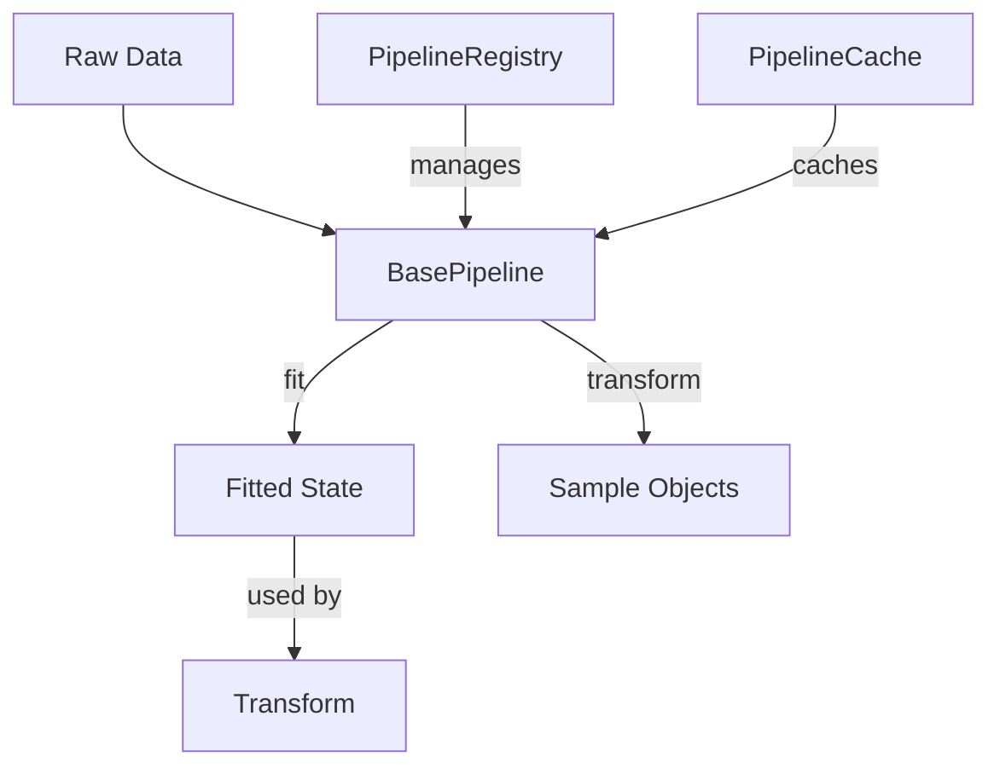
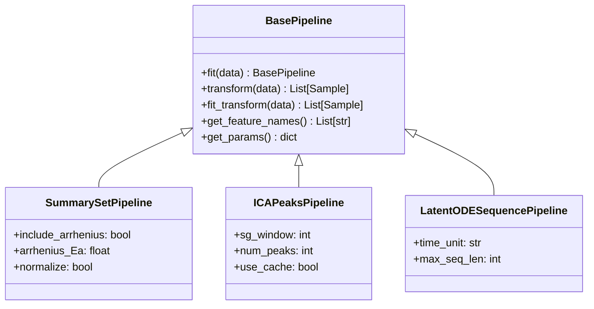
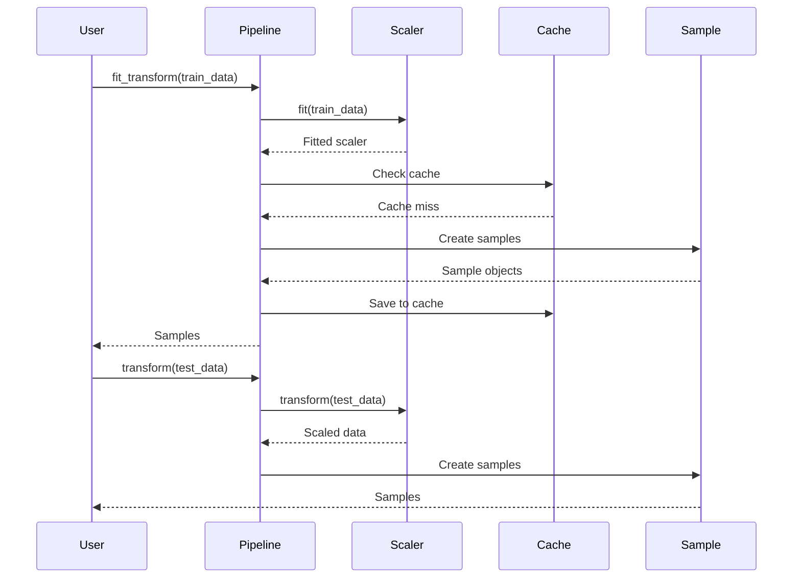
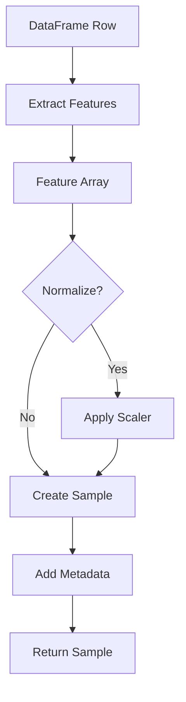
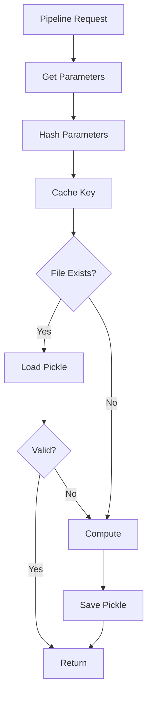
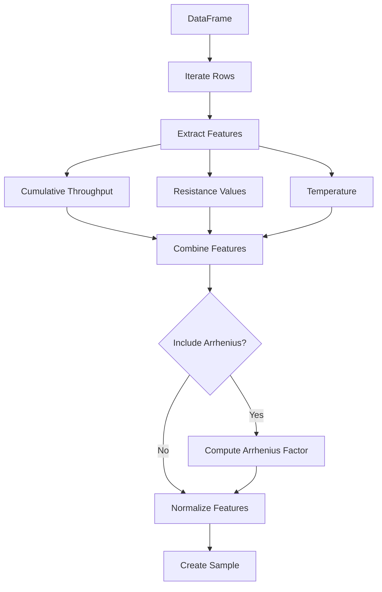
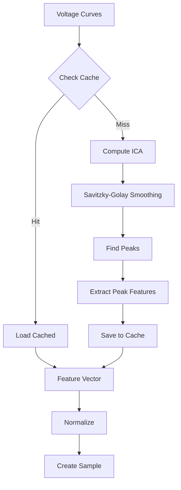
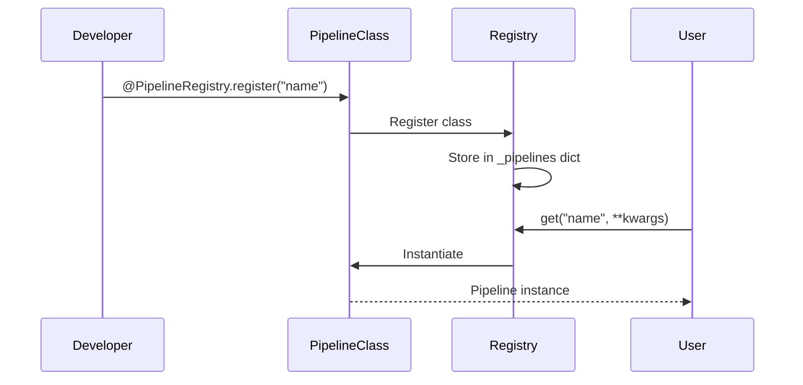
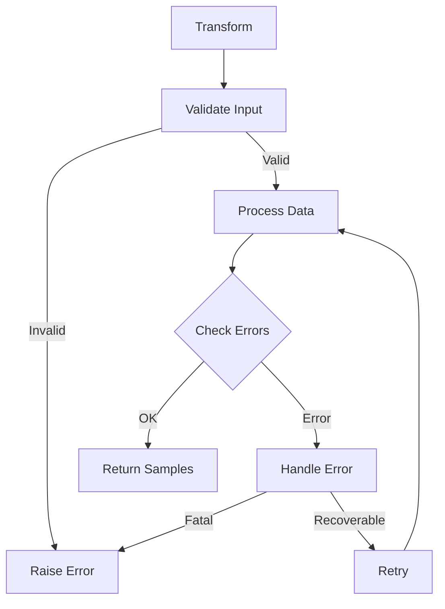

# Pipeline System

The pipeline system transforms raw data into `Sample` objects that models can consume.

## Pipeline Architecture

## Pipeline Interface

All pipelines inherit from `BasePipeline`:

## Pipeline Lifecycle

## Sample Creation

## Caching Strategy

## Feature Extraction Flow

### SummarySetPipeline

### ICAPeaksPipeline

## Pipeline Registration

## Error Handling

## Next Steps

- [Model System](model-system.md) - Model architecture
- [Custom Pipeline](../examples/custom-pipeline.md) - Create custom pipeline
- [API Reference](../api/pipelines.md) - Complete API docs
