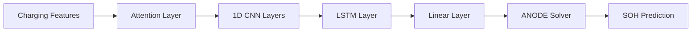

# ACLA Model Theory

The **ACLA (Attention-CNN-LSTM-ANODE)** model is a hybrid deep learning architecture designed for high-accuracy battery State of Health (SOH) estimation. It models battery degradation as a continuous-time dynamical system while leveraging both local and long-term temporal feature extraction.

## Architecture Overview

The ACLA architecture follows a sequential processing pipeline:

## Technical Details

### 1. Input Feature Engineering

The model uses charging curve characteristics that directly reflect aging phenomena like increased internal resistance. The feature vector $\mathbf{F}_k$ for cycle $k$ is constructed as:

$$ \mathbf{F}_k = (\text{SOH}_k, t_{k,1}, t_{k,2}, \dots, t_{k,N_v})^\top $$

Where $t_{k,i}$ are the normalized charging times at $N_v$ voltage sampling points (typically 19-21 points). This representation captures the electrochemical signature of the battery without requiring intensive physics-based modeling.

### 2. Attention Mechanism

The attention layer adaptively weights feature importance across different voltage regions. Research indicates that applying attention to the **first 3 features** (early charging phase) achieves the best accuracy-efficiency trade-off.

$$ \mathbf{A} = \mathbf{F} \mathbf{W} + \mathbf{b} $$
$$ \alpha = \text{softmax}(\mathbf{A}) $$

Where $\mathbf{W}$ and $\mathbf{b}$ are trainable parameters. The attended features are then passed to the feature extraction modules.

### 3. Feature Extraction (CNN-LSTM)

* **1D CNN**: Captures local temporal patterns and hierarchical features from the charging curves.
* **LSTM**: Models long-term dependencies and the temporal evolution of degradation over many cycles.

### 4. Augmented Neural ODE (ANODE)

The core of the model is the Augmented Neural ODE, which treats SOH evolution as a continuous-time process:

$$ \frac{d\text{SOH}}{d\tau} = f(\text{SOH}(\tau), \theta_\tau) $$

By augmenting the state with auxiliary dimensions, ANODE achieves better training stability and generalization across different battery chemistries compared to standard Neural ODEs.

### 5. Balanced Loss Function

ACLA uses a balanced mean squared error (MSE) that accounts for both the SOH prediction and the reconstruction of temporal features:

$$ \mathcal{L} = \frac{1}{N} \sum (\hat{\text{SOH}}_k - \text{SOH}_k)^2 + \frac{\lambda}{M} \sum |\hat{\mathbf{t}}_k - \mathbf{t}_k|^2 $$

### 6. Optimization

The model is optimized using **AdamW** with a **Lookahead** wrapper (synchronization period $s=5$, update rate $\beta=0.5$). Training follows a strictly defined three-phase learning rate schedule:

* **Warm-up** (220 iterations): Linear scaling from 0 to $10^{-2}$.
* **Stable** (500 iterations): Maintained at $10^{-2}$ for deep feature learning.
* **Decay** (280 iterations): Exponential decay to $10^{-5}$ for final convergence.

### 7. Evaluation Metrics

Apart from standard RMSE, ACLA uses the Relative Absolute Error for End-of-Life (EOL) prediction:

$$ \text{AE}_{\text{EOL}} = \frac{|\hat{\text{EOL}} - \text{EOL}|}{\text{EOL}} $$

## Performance Results

ACLA has demonstrated state-of-the-art performance across multiple datasets:

| Dataset | ACLA RMSE | ANODE RMSE | NODE RMSE | Improvement |
| :--- | :--- | :--- | :--- | :--- |
| **NASA** | 1.19% | 4.59% | 1.85% | 74% ↓ |
| **Oxford** | 0.93% | 1.17% | 1.46% | 20% ↓ |
| **HUST** | 2.24% | 3.45% | 5.22% | 35-57% ↓ |

The model maintains high accuracy even with reduced training data, demonstrating superior stability compared to standard Neural ODE architectures.
