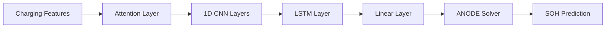

# ACLA Model Theory

The **ACLA (Attention-CNN-LSTM-ANODE)** model is a hybrid deep learning architecture designed for high-accuracy battery State of Health (SOH) estimation. It models battery degradation as a continuous-time dynamical system while leveraging both local and long-term temporal feature extraction.

## Architecture Overview

The ACLA architecture follows a sequential processing pipeline:

### 1. Attention Mechanism

The attention layer adaptively weights feature importance across different voltage regions. This is particularly effective for identifying degradation-sensitive areas in the charging curve.

\[
\mathbf{A} = \mathbf{F} \mathbf{W} + \mathbf{b}
\]
\[
\alpha = \text{softmax}(\mathbf{A})
\]

Where $\mathbf{W}$ and $\mathbf{b}$ are trainable parameters. The attended features are then passed to the feature extraction modules.

### 2. Feature Extraction (CNN-LSTM)

* **1D CNN**: Captures local temporal patterns and hierarchical features from the charging curves.
* **LSTM**: Models long-term dependencies and the temporal evolution of degradation over many cycles.

### 3. Augmented Neural ODE (ANODE)

The core of the model is the Augmented Neural ODE, which treats SOH evolution as a continuous-time process:

\[
\frac{d\text{SOH}}{d\tau} = f(\text{SOH}(\tau), \theta_\tau)
\]

By augmenting the state with auxiliary dimensions, ANODE achieves better training stability and generalization across different battery chemistries compared to standard Neural ODEs.

## Technical Details

### Balanced Loss Function

ACLA uses a balanced mean squared error (MSE) that accounts for both the SOH prediction and the reconstruction of temporal features:

\[
\mathcal{L} = \frac{1}{N} \sum (\hat{\text{SOH}}_k - \text{SOH}_k)^2 + \frac{\lambda}{M} \sum |\hat{\mathbf{t}}_k - \mathbf{t}_k|^2
\]

### Optimization

The model is optimized using **AdamW** with a **Lookahead** wrapper, following a three-phase learning rate schedule:

1. **Warm-up**: Linear increase to $10^{-2}$.
2. **Stable**: Constant rate for core convergence.
3. **Decay**: Exponential decay for fine-tuning.

## Performance

ACLA has demonstrated significant improvements (35-74%) in RMSE compared to baseline models like pure ANODE or LSTM, specifically in cross-dataset generalization (e.g., training on LCO/NMC and testing on LFP).
